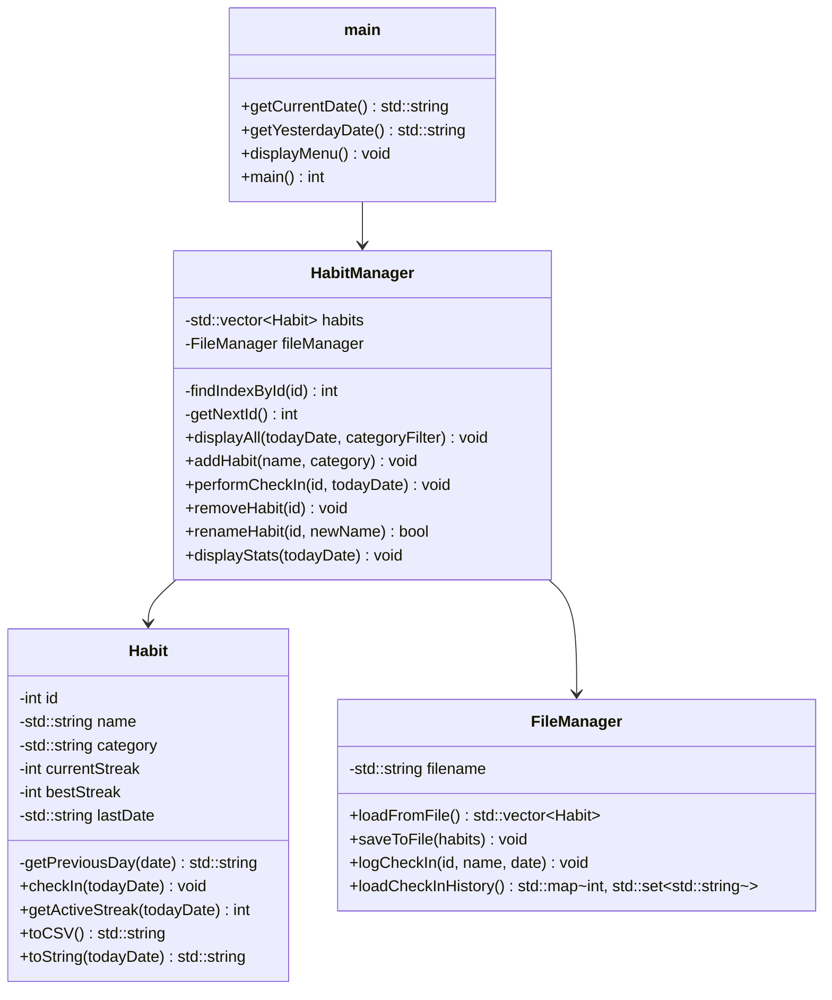

# 習慣養成打卡器 (Habit Tracker)

一個基於 C++ 實作的輕量級命令列（CLI）習慣養成與打卡追蹤系統。本系統採用經典的 3-Tier 架構設計，具備良好的模組化與單一職責原則（SRP），並針對 Windows 環境下的中文輸入/輸出進行了原生 API 層級的相容性優化。

---

## 一、開發環境說明

* **作業系統與編譯器**：
  * 支援 Windows 10/11 等作業系統。
  * 編譯器推薦使用 MinGW GCC (支援 C++11 或以上版本)，亦可直接使用 Dev-C++ 5.11 整合開發環境開啟專案檔 `HabitTracker.dev` 進行編譯與執行。
* **字元編碼 (Character Encoding)**：
  * 系統內部與持久化儲存全面採用 **UTF-8** 編碼。
  * 針對 Windows 主控台（Command Prompt / PowerShell）輸入與輸出中文時常出現亂碼的問題，系統在啟動時會透過 Windows 原生 API 強制將控制台的輸入與輸出編碼切換為 UTF-8（代碼頁 65001）：
    ```cpp
    #ifdef _WIN32
        SetConsoleCP(65001);       // 設定鍵盤輸入編碼為 UTF-8
        SetConsoleOutputCP(65001); // 設定終端機輸出編碼為 UTF-8
    #endif
    ```
* **資料存取方式 (Data Access)**：
  * 採用本地文字檔案進行持久化儲存（即時讀寫，無須架設資料庫）。
  * 使用 C++ 標準庫的 `<fstream>` (`std::ifstream`, `std::ofstream`) 與 `<sstream>` 進行 CSV 檔案的讀寫與解析。
  * 在寫入 CSV 檔案時，系統會自動在檔案開頭寫入 **UTF-8 BOM** 標記 (`\xEF\xBB\xBF`)，確保使用者在使用 Microsoft Excel 或 Windows 記事本開啟資料檔時，中文字元能被正確辨識且不發生亂碼。
* **輸入輸出方式 (I/O)**：
  * **輸入**：透過 `std::cin` 讀取選單指令，並使用 `std::getline(std::cin, ...)` 讀取含有空白的中文字串（如習慣名稱、自訂分類或手動輸入的日期）。系統具備嚴格的流狀態清除與輸入緩衝區清理機制（使用 `std::cin.clear()` 與 `std::cin.ignore()`），以防止使用者輸入非法字元或空字串導致程式崩潰或進入無窮迴圈。
  * **輸出**：透過 `std::cout` 輸出互動式選單、操作成功/錯誤提示，並利用格式化輸出（如 `<iomanip>` 中的 `std::setw`）展示對齊美觀的習慣清單與 ASCII 統計分析圖表。
* **資料儲存邏輯 (Data Storage)**：
  * **習慣設定資料 (`habits.csv`)**：採用 6 欄位格式儲存：
    `id,name,category,current_streak,best_streak,last_date`
    * *相容性設計*：載入檔案時若偵測到舊版的 5 欄位格式（無分類欄位），系統會自動將分類補為 `"一般"`，確保舊版數據可無縫升級。
  * **打卡歷史日誌 (`checkins.csv`)**：採用 3 欄位格式記錄每次成功的打卡：
    `id,name,date`
    * 每次打卡成功時，系統會以**追加模式 (Append)** 寫入該筆紀錄，作為後續生成歷史打卡圖表與累計數據的分析來源。

---

## 二、系統功能摘要

本系統提供豐富的命令列互動功能，主要選單如下：

1. **顯示所有習慣**：
   * 支援顯示所有習慣的 ID、名稱、分類、當前連續天數、歷史最佳天數與最後打卡日期。
   * 支援**分類篩選**，可選擇僅顯示特定分類（如：運動、學習、健康、工作或自訂分類）的習慣。
2. **新增習慣**：
   * 建立新的習慣，並可選擇內建分類（運動、學習、健康、工作）或手動輸入自訂分類。
3. **進行習慣打卡 (含補卡)**：
   * 支援**今日打卡**（自動獲取系統日期）。
   * 支援**昨天補卡**（自動計算昨日日期）。
   * 支援**手動輸入自訂日期補卡**（格式為 `YYYY-MM-DD`）。
4. **修改習慣名稱**：
   * 輸入習慣 ID，即可重新設定習慣的顯示名稱，並即時更新至 CSV 檔案。
5. **刪除習慣**：
   * 輸入習慣 ID，從系統中移除該習慣，並同步更新 `habits.csv`。
6. **顯示統計分析**：
   * 顯示專案整體數據：總追蹤習慣數、今日打卡進度與打卡率。
   * 顯示個別習慣數據：累計打卡天數、當前連續天數、歷史最佳天數。
   * **ASCII 7天打卡網格**：自動根據當前日期回推，繪製最近 7 天的打卡矩陣圖（`■` 表示已完成，`□` 表示未打卡），直觀展示打卡進度。
7. **離開系統**：
   * 安全關閉檔案並結束程式。

---

## 三、系統特色與優點

1. **經典的 3-Tier 架構設計**：
   * 將使用者介面 (UI)、業務邏輯控制 (Manager) 與資料持久化存取 (DAO/File) 完全抽離，代碼清晰，維護性與擴展性極高。
2. **動態連續天數更新 (Dynamic Streak Decay)**：
   * 當前連續天數（Current Streak）在讀取與顯示時會根據當前系統日期進行**動態過期檢測**。若使用者超過 1 天未打卡，系統會在清單與統計中將當前連續天數動態顯示為 `0`，而不需要在開啟程式時立刻對檔案進行寫入，有效降低磁碟 I/O，且打卡邏輯依然嚴密。
3. **Windows 原生 API 級別優化**：
   * 捨棄了傳統 `system("chcp 65001")` 命令（該方式在 Windows 上會因啟動子行程而損壞重導向控制代碼，導致自動化測試與輸入管道中斷）。改用 Windows API 的 `SetConsoleCP` 與 `SetConsoleOutputCP`，從核心解決亂碼與管道破裂問題。
4. **完善的防呆與安全機制**：
   * **時間防呆**：禁止使用者重複打卡相同日期，且禁止為小於「最後打卡日期」的過去時間補打卡，確保 Streak 計算與歷史日誌的遞增邏輯不受干擾。
   * **輸入防呆**：處理鍵盤輸入與讀取失敗（如輸入非數字字元、輸入 EOF），會自動回復狀態並跳過非法字元，杜絕命令列常出現的死循環當機。

---

## 四、系統詳細介紹（類別架構）

專案由以下核心模組組成：



### 1. 使用者介面層 (`main.cpp`)
作為系統的進入點，負責：
* 呼叫 Windows API 調整字元集。
* 獲取當前系統時間與昨日時間，格式化為 `YYYY-MM-DD`。
* 輸出精美選單並引導使用者輸入，根據使用者選擇的分支，呼叫 `HabitManager` 的對應服務。

### 2. 資料實體層 (`Habit.h` / `Habit.cpp`)
代表單個習慣的資料結構與核心打卡邏輯：
* 儲存 ID、名稱、分類、當前連續次數、最佳次數、最後打卡日期。
* 實作 `checkIn(date)`，透過 `getPreviousDay` 計算前一天以判斷 Streak 是否中斷，並動態更新最佳紀錄。
* 提供 `getActiveStreak(todayDate)` 實作動態過期檢測。
* 提供 CSV 序列化方法 `toCSV()` 與格式化字串輸出 `toString(todayDate)`。

### 3. 控制/邏輯層 (`HabitManager.h` / `HabitManager.cpp`)
維護記憶體中的習慣清單 (`std::vector<Habit>`)，協調業務邏輯：
* **習慣管理**：實作新增、刪除、尋找與重新命名。
* **分類控制**：在顯示清單時根據篩選字串過濾習慣。
* **打卡記錄**：在打卡成功後，同步寫入主設定檔並記錄至歷史日誌中。
* **統計渲染**：分析打卡日誌，並負責渲染最近 7 天的 ASCII 打卡網格與對齊格式。

### 4. 資料存取層 (`FileManager.h` / `FileManager.cpp`)
封裝對本地檔案的讀寫操作，確保資料持久性：
* `loadFromFile`：解析 CSV 格式設定檔，相容 5 欄位舊格式，轉換為 Habit 物件集合。
* `saveToFile`：將 Habit 物件集合轉換為 CSV 字串並寫入檔案，寫入 UTF-8 BOM 以保障中文字元。
* `logCheckIn`：將打卡紀錄寫入歷史檔案 `checkins.csv`（自動在首次建立時寫入 BOM 標頭）。
* `loadCheckInHistory`：讀取歷史打卡日誌並歸納成以 ID 為 Key、打卡日期 Set 為 Value 的 Map 結構，提供有效率的 O(1) 歷史打卡查詢。
